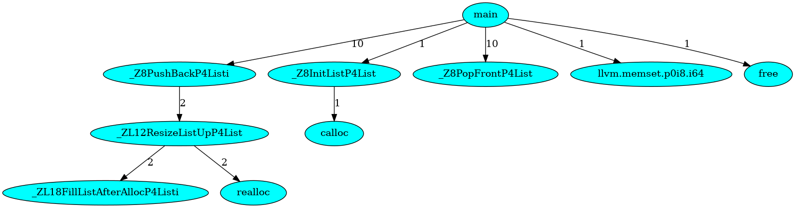

# Call graph builder based on LLVM Pass

## Brief description


Edges contain number of function calls.

## How to build
```
$ git clone https://github.com/andreyStrachuk/CallGraph
$ cd CallGraph
$ mkdir build && cd build
$ cmake ../
$ make 
```

## Run test graph

You can try generate graph to test this pass. To do this:
```
$ cd ../test
$ make
$ dot -Tpng dump_dot.txt -O
$ eog dump_dot.txt.png
$ rm inter.txt
```